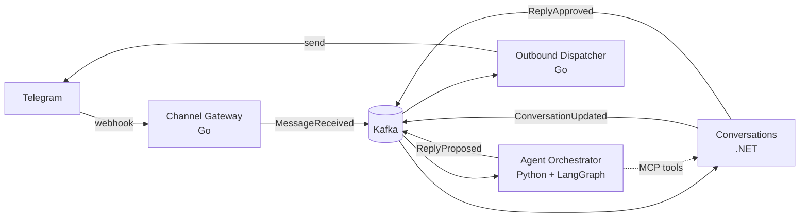

# Parley

Omnichannel customer service platform with AI agents: a public reference
architecture for **reliable messaging (Kafka, Outbox/Inbox)**, **DDD + CQRS +
Vertical Slices** and **MCP**, across **Go, .NET and Python**.

> Status: under construction — Release 1 (local end-to-end flow) in progress.

## What it does

A customer writes on Telegram. Parley stores the message exactly once, an AI
agent (LangGraph) proposes a reply, the Conversations domain approves it or
hands the conversation to a human, and the reply is delivered back to the
customer — with ordering per conversation and no message lost if a service
goes down.

## Architecture at a glance

| Service | Stack | Bounded context |
| --- | --- | --- |
| Channel Gateway | Go | Channels (ingress) |
| Outbound Dispatcher | Go | Channels (egress) |
| Conversations | .NET 10 | Conversations (core) |
| Agent Orchestrator | Python 3.13, LangGraph | Agent (core) |

- Every service: `domain/` + `features/<use_case>/` + `infrastructure/` + `bootstrap/`.
- Commands change state through aggregates; queries read projections.
- Events leave a service only through its Outbox; consumers deduplicate with an Inbox.
- MCP tools are one more entry point to the same use cases.
- LLM provider is configurable (`LLM_PROVIDER`, default Groq).

## Documentation

- [Requirements and user stories](docs/requirements.md)
- [Ubiquitous language](docs/domain/ubiquitous-language.md) · [Context map](docs/domain/context-map.md)
- [Architecture Decision Records](docs/adr/)
- [AI-assisted development setup](CLAUDE.md) (rules, skills and subagents in `.claude/`)

## Getting started

_Coming with OC-001._

## License

MIT
